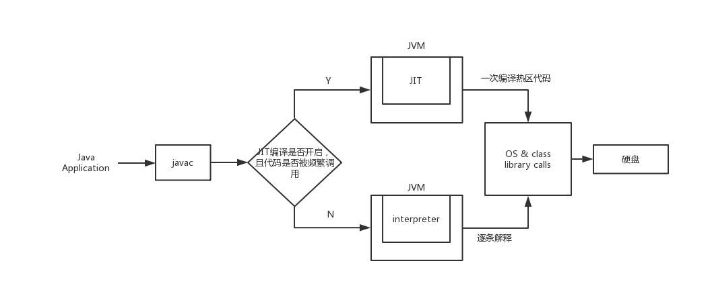

# JVM中的JIT技术

## JIT简介：

JIT全称是 `just in time` （即时编译技术），理论上能够加快Java程序的运行速度。

通常情况下，Java代码经由 `javac` 将程序源码编译成 `.class` 字节码，再由JVM一行一行解析字节码，翻译成相应的机器指令，其执行速度会比机器码慢很多。

~~JIT会将使用频率很高的字节码部分直接编译成机器码并保存下来，这样能够加快Java程序的运行速度。~~

JIT是动态编译的一种表示形式，允许自适应优化，如**动态重新编译（dynamic recompilation）**和**微架构特定的加速（microarchitecture-specific speedups）**。在运行时，实现了JIT编译器的系统通常**连续分析**正在执行的代码，并从正在执行的代码中选出被**频繁重复执行**的部分，将其转换成机器代码，理论上来说，JIT编译可以比静态编译的执行速度更快（某些情况下程序运行速度并不能更快，甚至可能更慢），然后在不需要重新编译的情况下进行**缓存和重用**。

解释和JIT编译特别适用于动态编程语言，因为系统可以处理后期绑定数据类型并实施安全保证。

### 1、JIT的优缺点

JIT编译结合了两种传统机器代码翻译方法（提前编译AOT和解释）。

他具有两者的优点和缺点：

- JIT编译结合了编译代码的**速度**和解释的**灵活性**
- JIT编译不仅拥有解释器的**开销**，还拥有编译的**额外开销**

### 2、使用JIT可能优于静态编译器的原因

系统能够收集有关程序在其所处环境中的实际运行的统计信息，并且可以重新排列

- JIT编译可以针对目标CPU和运行应用程序的操作系统模型进行优化。
- 能够收集程序在其所处环境中实际运行的统计信息，并且可以重新排列和重新编译以获取最佳性能。但是一些静态编译器也可以将配置文件信息作为输入。
- 在进行全局内联替换时，静态编译过程可能需要运行时检查，确保对象的实际类重写了内联方法，否则可能发生虚拟调用，或者可能需要在循环中处理对数组访问的边界条件检查。而通过即时编译，可以将这种处理移出循环，通常可以大大提高速度。（Java会把数组越界检查的字节码插入.class，后面会将其移除）
- 字节码系统可以容易地重新安排执行的代码以获得更好的缓存利用率，虽然这可以通过静态编译的垃圾收集实现。

## HotSpot中JIT工作流程图：

  
 

Sun的HotSpot JVM使用的一种可能的优化是结合解释和JIT编译。

最初JVM解释应用程序代码，一旦JVM监视频繁执行地字节码序列，就将其转换为机器代码，以便在硬件上直接执行。

- 对于仅执行几次的字节码，这节省了编译时间并减少了初始延迟；
- 对于频繁执行的字节码，在慢速解释的初始化阶段之后，JIT编译用于高速运行；

### 关于HotSpot虚拟机

Sun的Java虚拟机有两种主要模式，客户端（Client）和服务器（Server）；

- 客户端（C1编译器）（in client mode），执行最少的编译和优化；
- 服务器（C2编译器）（in server mode），执行大量编译和优化，以便在应用程序运行时通过牺牲启动时间来最大限度地提高性能。

其他Java即时编译器使用运行时测量方法执行的次数与方法的字节码大小相结合作为启发式来决定何时编译。

还有一个使用与循环检测结合执行的次数。

通常，准确预测在短期运行应用程序中优化哪些方法比长期运行的应用程序更难实现。

### 启动延迟问题

由于加载和编译字节码所花费的时间，JIT在应用程序的初始执行中会有轻微的明显延迟，这种延迟就称为“启动时间延迟”或“预热时间”。

一般情况下，JIT执行的优化越多，它将生成的代码越好，但初始延迟也会增加。因此，JIT必须在编译时间和生成的代码质量之间进行权衡。

在下列这种场景下，还需优化他的延迟问题：JVM的rt.jar的大小为40MB，并且JVM必须在此上下文大文件中搜索数据。除了JIT编译之外，启动时间可以增加IO绑定操作。

#### 减少初始延迟的方法

微软的 Native Image Generator （Ngen）将公共中间语言图像中的字节码预编译到机器本机代码中，因此不需要运行时编译。缺点是生成的代码质量不如**JIT编译**那样好；因为静态编译的代码在极端情况下不能像JIT编译代码那样好，缺少分析数据来驱动，例如内联缓存。

## 热点代码：

当虚拟机发现某个方法或者代码块的运行特别频繁时，就会把这些代码认定为“热点代码”。

- 被多次调用的方法

  一个方法被调用得多了，方法体内的代码执行的次数就会变多。

- 被多次执行的循环体

  一个方法虽然只被调用过一次或少量的几次，但是方法体内部存在循环次数较多的循环体，这样循环体的代码也被重复执行多次

### 如何检测热点代码

判断一段代码是否是热点代码，是否需要触发即使编译， 这样的行为称为热点探测，热点探测并不一定需要知道方法具体被调用了多少次。

|                      | 简介                                                         | 优点                                                     | 缺点                                                         |
| -------------------- | ------------------------------------------------------------ | -------------------------------------------------------- | ------------------------------------------------------------ |
| 基于采样的热点探测   | 采用这种方法的虚拟机会周期性的检查各个线程的栈顶，如果发现某个（或某些）方法经常出现在栈顶，那这个方法就是 “热点方法” | 实现简单高效，容易获取方法调用关系（将调用堆栈展开即可） | 不精确，容易因为因为受到线程阻塞或别的外界因素的影响而扰乱热点探测 |
| 基于计数器的热点探测 | 采用这种方法的虚拟机会为每个方法建立计数器，统计方法的执行次数，如果次数超过一定的阈值就认为它是 “热点方法” | 统计结果精确严谨                                         | 实现麻烦，需要为每个方法建立并维护计数器，不能直接获取到方法的调用关系 |

#### 计数器的种类（两种共同协作）

| 计数器种类     | 简介                                                         |
| -------------- | ------------------------------------------------------------ |
| 方法调用计数器 | 这个计数器用于统计方法被调用的次数。默认阈值在 Client 模式下是 1500 次，在 Server 模式下是 10000 次 |
| 回边计数器     | 统计一个方法中循环体代码执行的次数                           |

## 分层编译：

产生的原因：由于即时编译器编译本地代码需要占用程序运行时间，想要编译出优化成都更高的代码，所花费的时间可能更长；而且想要编译出优化程度更高的代码，解释器可能还要替编译器收集性能监控信息，这对解释执行的速度也有影响。因此为了在程序启动相应速度与运行效率之间达到最佳平衡，HotSpot虚拟机启用**分层编译**的策略。

分层编译根据编译器编译、优化的规模与耗时，划分出不同的编译层次：

- 第0层：程序解释执行，解释器不开启性能监控功能，可触发第1层编译
- 第1层：也成为C1编译，将字节码编译为本地代码，进行简单、可靠的优化，如有必要将加入性能监控的逻辑
- 第2层：也称为C2编译，也是将字节码编译为本地代码，但是会启用一些编译耗时较长的优化，甚至会根据性能监控信息进行一些不可靠的激进优化

实施分层编译后，Client Compiler 和 Server Compiler 将会同时工作，许多代码都可能会被多次编译，用 Client Compiler 获取更高的编译速度，用 Server Compiler 获取更好的编译质量，在解释执行的时候也无须再承担收集性能监控信息的任务。

## 编译优化技术

1. 语言无关的经典优化技术之一：公共子表达式消除
2. 语言相关的经典优化技术之一：数组范围检查消除
3. 最重要的优化技术之一：方法内联
4. 最前沿的优化技术之一：逃逸方法

> IBM Develop文章
>
> <https://www.ibm.com/developerworks/cn/java/j-lo-just-in-time/index.html>
>
> https://www.ibm.com/support/knowledgecenter/SSB23S_1.1.0.14/com.ibm.java.lnx.80.doc/diag/understanding/jit.html
>
> Wikipedia百科
>
> <https://en.wikipedia.org/wiki/Just-in-time_compilation>
>
> CSDN博客文章
>
> <https://blog.csdn.net/zhaohong_bo/article/details/89421055>
>
> 简书
>
> <https://www.jianshu.com/p/fbced5b34eff>