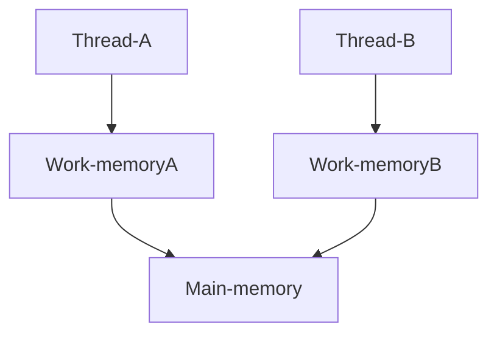
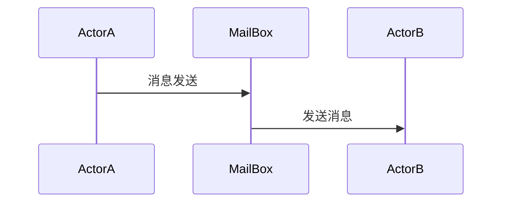

# 并发模型

## 一、线程与锁

**共享内存模型**

### 1、特点

线程与锁模型是对底层硬件运行过程的形式化。这是该模型最大的有点，也是它最大的缺点。

### 总结

线程与锁模型目前有三个主要危害——竞态条件、死锁和内存可见性，主要有以下方法可以避免：

- 对共享变量的所有访问都需要

## 二、函数式编程

函数式编程：；

命令式编程：；

**可变状态的风险：**

- 隐藏的可变状态
- 逃逸的可变状态

Future模型

Promise模型

## 三、Clojure之道——分离标识与状态

命令式语言中，变量默认都是状态易变的；

不纯粹的函数式语言中，变量默认是状态不易变的，代码仅在十分必要时才修改变量；

### :large_orange_diamond:**原子变量**

原子性的变量，例如Java的juc包下的atomic

### :large_orange_diamond:**持久数据结构**

并非指数据持久化到磁盘或者保存到数据库中，而是指数据结构被修改时总是保留其之前的版本。

> REPL，(Read Eval Print Loop:交互式解释器)

#### 共享结构

同时持久数据结构的实现有更精巧的方法，并非Java中`CopyOnWriteArrayList`一样，创建一个完整的副本，而是使用了更精巧的方法，其中使用了*共享结构*。

共享结构下，拥有共同尾端的列表可以共享结构；如果两个列表具有不同的尾端，就只能进行复制了。

### :large_orange_diamond:标识与状态

#### 分离标识与状态

如果一个线程引用了持久数据结构，其他线程对数据结构的修改对该线程不可见。

#### 重试

其原子变量无锁，其内部实现使用了`java.util.concurrent.AtomicReference`包提供的`compareAndSet()`方法。因此使用原子变量的效率很高且不会发生阻塞。

但是如果发生了这种情况，swap!就需要重试（Retry）。swap!将放弃从参数函数中返回的值，并用原子变量的新值重新调用参数函数。

#### 校验器

当改变原子变量的值时就会调用它，如果校验器返回true，就允许这次修改，否则就放弃这次修改。

校验器在原子变量改变生效**之前**被调用，当swap!进行重试时，校验器会调用多次，因此校验器不应有副作用。

#### 监视器

添加时需提供一个键值和一个监视函数，键值区分不同的监视器。

当原子变量的值被改变时会调用监视器。

监视器接受四个参数——调用add-watch时指定的键值、原子变量的引用、原子变量的旧值、原子变量的新值。

监视器有副作用，由于监视器在原子变量的值改变之后才调用，且无论swap!重试多少次，监视器只会被调用一次。

------

> 两种可变数据类型：代理（agent）和引用（ref），代理和引用可用于并发，也能与持久数据结构一起使用，实现标识与状态的分离。
>
> 学习引用时，还有关于对软件事务内存的支持，使变量在无锁的情况下可以被并行地修改，同时保持一致性。

### :large_orange_diamond:代理

与原子变量类似，代理包含了对一个值的引用；

代理与Actor的区别：

- 代理可以获得值，而actor没有提供直接获得值的方式；
- actor可以包含行为（behavior），而代理则不可以；
- actor提供了复杂的错误检测和错误恢复的机制，而代理仅提供了简单的错误报告机制；
- actor能支持分布式，而代理则不能；
- 使用多个actor可能会引发死锁，而使用多个代理则不会；

#### 等待代理的操作完成

~~由于传给代理的异步运行~~

- 使用Thread/sleep来延长函数的运行时间
- 使用Clojure提供的await函数 （阻塞直至线程派给代理的操作全部完成）
- 使用Clojure提供的await - for函数（可以指定等待的超时时间）

#### 错误处理

支持校验器和监视器。

一旦代理发生错误，就会默认进入失效状态，之后对代理数据的任何操作都会失败。

- agent-error可以查看一个代理是否为失效状态及失效原因；
- restart-agent可以重置失效状态的代理；

创建代理时，错误处理模式默认为fail，如果设置为continue（即无需restart-agent重置就可以处理新的操作）。

设置了错误处理函数的话，且错误处理模式为continue，代理出错时则会调用错误处理函数。

#### 内存日志系统

并发情况下，对于每行日志都会进行多次上下文切换和IO操作。线程与锁模型实现内存日志系统比较复杂，而使用代理来实现就非常简单。

------

### :large_orange_diamond:引用ref

原子变量和代理每次仅能修改一个变量，而通过STM可以对多个变量进行并发一致的修改，如同数据库的事务可以对多条记录进行并发的一致的修改一样。

通过引用可以实现软件事务内存（Software Transactional Memory，STM）。

引用的值可以通过ref-set来设置，可以通过alter函数来修改引用的值，且只能在一个事务中才能修改引用的值。

#### 事务

STM事务具有原子性、一致性和隔离性。

这三个性质与许多数据库支持的ACID特性中的前三个一致。唯一遗漏的是持久性。

> 事务必须具有隔离性吗？
>
> 可以通过使用commute替换alter，就可以得到不那么强的隔离性。

## 四、Actor

Acotr模型是一种适用性良好的通用并发编程模型，与另一种**模型共享内存（线程与锁）**完全相反，可以应用于共享内存架构和分布式内存架构，适合解决地理分布型的问题，同时还提供很好的容错性。

> Q：什么是地理分布型的问题？
>
> A：客户端、服务器地理分布。

Erlang在语言级对Actor提供了支持；Scala也提供了Actor，Java也有第三方的Actor包；Go语言的channel机制也是一种类Actor机制；

:link:[Actor 模型 / CSP模型 / 共享内存模型](<https://www.cnblogs.com/lizhensheng/p/11117459.html>)

------

### :large_blue_diamond:Actor模型

不共享任何内存，通过消息传递的方式进行合作，相互线程独立。

> Q：是actor还是进程？
>
> A：在Elixir中，类似在Erlang中，actor对象被称为进程。大部分场景下，进程是一个重量级的概念，会消耗很多资源，且创建代价很高。在Elixir中，进程是一个轻量级的概念，比操作系统级的线程还要轻量：消耗更少资源，且创建代价很低。可以毫无困难创建数千个进程，通常不需要依赖线程池等技术。

#### :small_blue_diamond:队列式信箱

**异步地发生消息**是actor模型编程的重要特性之一。

按照信箱接受消息的顺序来依次处理消息，且仅在当前消息处理完后才会处理下一个消息，只需关心发送消息时的并发问题即可。

**接受消息**

## 五、通信顺序进程

## 六、数据并行

## 七、Lambda架构

（《七周七并发模型》读书笔记）